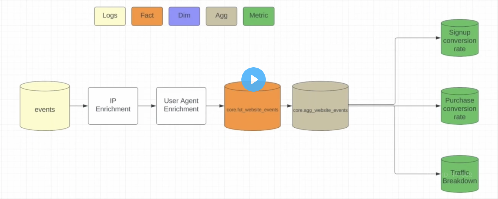

### Background

Day1 lab, **Spec-Building Document**, is to demo how a spec document should be developed for a pipeline intended to be productionized. 

### Components of the Document 

I. Intro Page/header 

* Project title 

    + should be reflective of what the goal of the pipeline will be 

* 1-2 sentence description of the organization that the pipeline is being built for 

* description of the pipeline 

    + recommend to have it formatted as "what questions is the pipeline trying to answer"

    + ex question: what percent of the site traffic signup for a newsletter? How many visitors of the app make a purchase?

    + the reader of the doc should come away thinking, "hey these are questions I have too!"

    + ideally should set the scene as to relate what the analyst is interested as well 

II. Business Metrics

* the defined metrics here shuld be based on the questions highlighted in the description

* the metric definitions here are quite simple and preliminary, they are better formatted/defined later on in the schema section

* guardrail metric is one that is meant to provide the business an indication of the success or failure of the application performance its measuring. The business is supposed to examine this metric to determine if the given app/service is ready to go live or not 

* non-guardrail one is not as strict for whether the value indicates success or not, it is not meant to be interpreted by business for go live or not

metric name | definition | is it a guardrail?
------------|------------|-------------------
| signup_conversion_rate | count(signup)/count(website_hit) | Yes (can indicate issue with landing page)
| purchase_conversion_rate | count(purchases)/count(signups) | Yes (can indicate issue with checkout page)
| traffic_breadown_rate | count(website_hits) group by referrer/hit_origin | No (source of this value has no impact on app/service performance)

III. Flow Diagrams 

* there isnt a strong need to elaborate/include the data source here, audience assumes the DE/AE will use the correct one

* it should try to demonstrate the data transformation from raw source to marts 

* also demonstrate any additional enrichment/cleanup data steps that should be taken 

IV. Schemas

* consists of a list of intended tbls that will be modelled 

* should include of brief description for table that entails what the content of the model will be and associated meta/enriched data that will be included 

* for each model, provide a DDL like description along with comments. This is to give a full description of what the schemas will consists of 

* example tbl/schema:

    + **core.fct_website_events**: this table is a list of all events for `app name` and includes IP/user agent enrichment for country and device specific information. The unique identifier for this tbl is logged_out_user_id and event_timestamp

    + tbl schema:

        column name  | column type | column comment 
        -------------|-------------|---------------
        | user_id | bigint | nullable for logged out events, indicative of the users logging status at the time of event generation |
        | logged_out_user_id | bigint | primar key of tbl, not nullable, a hash of IP address and device info (murmur3 hash) |
        | dim_jostname | string | the host associated with event |
        | dim_country | string | the country associated to the IP from which the event was produced |
        | dim_device | string | is nullable (due to bots visiting app), the device brand/make from the IP originated from when creating the event |
        | dim_action_type | string | enumerated list of actions that a given user can take on the app: sign-up, watch-video, hit landing page |
        | event_timestamp | timestamp | UTC timestamp when the event occured |
        | other_properties | map[string, string] | any other valid properties that are part of the request |
        | ds | string | parition column for this tbl |

* notes/tid-bits on schemas

    + the parition column (ds) is usually the last column of the tbl 

    + something about detecting dupicate records when there are 2 logged_out_user_id values. 2 of these records indicate that the same IP/user hit the same page at the same time which seems unlikely. This is usually resolved by the event timestamp. 2 identical IDs are not error if they have slightly different timestamps.

    + another tbl to propose is an aggregate tbl of the fct tbl. aspects to include/consider:

        - the time granularity to have it in: daily, weekly, monthly etc 

        - include the dimension (`dim_`) cols here

        - of course the aggr metrics (`m_`): count, sum, avg etc 

        - `aggregation_level`: indicates how the aggregation of the record was performed. The goal of this colum is to verify that the major aggregations are performed by the pipeline and the analyst doent have to do this when working with the tbl in mart, only thing have to do is select and divide. How this can be performed is elaborated in [2_recursive_ctes_window_functions](../../applying_analytical_patterns/2_recursive_ctes_window_functions/README.md), line 63 with `group by grouping sets`. 

* QA checks:

    + should be documented for each proposed tbl 

    + following columnar tests to implement for **fct tbls**: not null, unique/not null (for primary key), that certain columns follow a specific format (IP address, enum column types)

    + follwoing aggr test to implement for **aggr/mart tbls**: row count (i.e. overall rollup aggregation stats are greater than the other ones), older time periods exhibit expected seasonality, total event count greater than some minimum count (*not too sure about this one but anticipate this will become clear in the future*)

    + should document the specific test and which column are applicable to each test 

    + also conduct simple aggregation checks (row count, sum etc) to verify that certain event types have a healthy aggr value, i.e. know that a good majority of events should be sourced by certain devices or hostnames

    + also think about what kind of quality checks to do upstream vs downstream tbls (fct vs aggr tbls). What quality checks should be performed at the transaction level? If a given check has already been performed on an upstream tbl (fct), is it really necessary to perform it again in the downstream tbl (aggr)? The purpose is to design the transformation in such a way where:

        * design transformation that yields tbls at an accurate granularity with little to no surprise of record edge cases 

        * test reflect that know what the tbl should be transformed as and verify that the final format meet the expectations 

        * trust the input of downstream tbls because its been verified when it was built in the upstream tbl 

    + when decided what test go where think of the following: 
        
        * how does the given app/service/website log activity? 

        * when there is a null in a given column, what could tht possibly mean? intended user activity or bot?

        * the columns that for sure the log data always captures no matter what should be not null

        * for columns that can be null yet the app logs the evevnt ex: bot visit will not have a device type, users visiting as guest may not have a user_id

        * where do we anticipate the majority of the events coming from? check that the assumption is confirmed by quicky stats